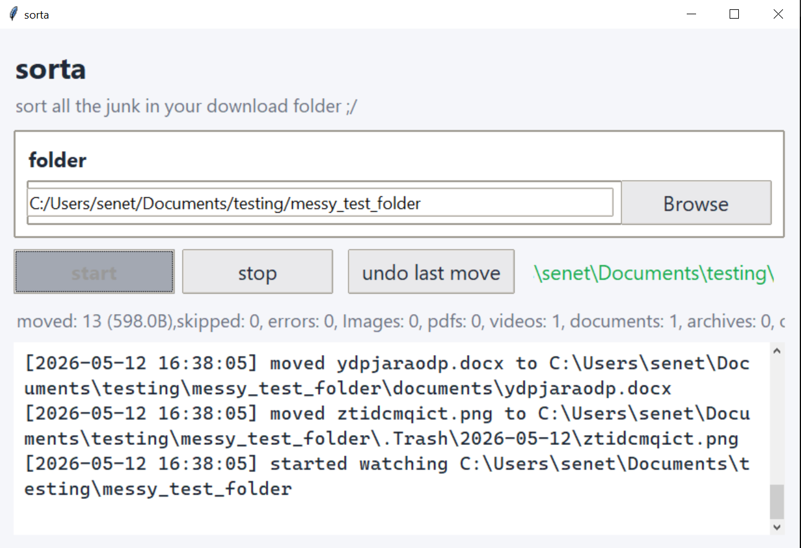

## Sorta
Sorta is a python app made to sort files in a given directory. It sorts files based on their extensions and moves them into seperate folders.

## Features
- sort files besed on their extensions
- stats counter for each file type sorted
- gui for easy use
- cross platform with python
- log file in development for debugging
- undo last action

## Demo

## Development
You need to have python installed on your computer to run this app.
1. Clone the repository
2. Make necessary changes to the code in the `main.py` file
3. Run the app using `python main.py` command in the terminal within the directory of the repository.

## Download
You can download the latest version from the [releases](https://github.com/sen3th/sorta/releases). Currently, only the windows version is available as a release. You can still run the app on other operating systems by running  `main.py` using python.

## Contributing
Feel free to contribute to this project by forking the repository and creating a pull request with you changes.